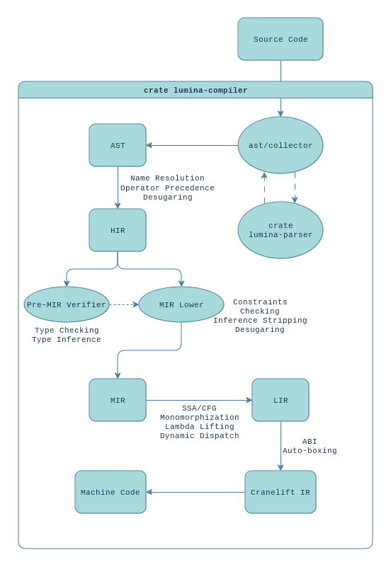

## The Lumina Programming Language

Lumina is an eager-by-default natively compiled functional programming language with the core goals of readibility, practicality, compiler-driven development and simplicity. 

It aims to be a high-level general-purpose language, but also support systems-level functionality such as raw pointer arithmetics to allow for high-level abstractions to be built on top of low-level high performance Lumina code. 

## Documentation

A work-in-progress guide is available at https://docs.luminalang.com/

Examples are available in the `examples/` folder

## Supported Targets

* `x86_64-linux-glibc`
* `x86_64-linux-musl`

(many more planned)

## Compiler Developer Documentation

This project is using `tracing_tree` combined with `env_logger`. To track a specific entity throughout the compilation pipeline, use: 
`RUST_LOG="[{entity=myFunction}]=trace"`

To get an overview look of what the compiler is doing; use `RUST_LOG=info`

### Compiler Overview

### Status

Most language features, basic and advanced, lower to LIR and can compile natively with Cranelift. 
Since there is no finished garbage collector, all allocations currently leak unless manually freed with `do libc:free ptr then ...`. 

C-representation of declared data is currently not supported. To call FFI functions you need to write in primitives manually according to the C-abi.
Lumina's own ABI is currently a transparent representation of the data given. So; the C ABI can be followed manully on top. 

The standard library is severely lacking and doesn't have much outside of basic int, list, string, stdout, and file io. 
All of this is written in a non-platform-agnostic way and needs to be changed to properly utilise `@[platform "..."]` rules. 

### Known remaining high-priority tasks

 - [ ] Garbage Collector (Linking to `mmtk` works, but I'm not sure what we'll end up doing)
 - [x] Make `pub` actually have an effect.
 - [ ] Basic guide/showcase
 - [x] Replace all remaining `todo!("ET: ");`s with proper error messages
 - [x] Give the compiler the ability to detect and use system linkers
 - [x] Vectorised linked lists or finger trees as default list desugaring
 - [x] Fix the type checker sometimes confusing the expected type with the given type and vice-versa
 - [ ] Basic Windows target
 - [ ] Basic MacOS target
 - [ ] Basic introductory website hosted on our domain
 - [x] Re-add the unreachability warning messages
 - [x] Strings
 - [ ] Basic standard library
 - [ ] Floats
 - [ ] Reflection API with const-time folding post-monomorphization (plan is to use this instead of macros)

### Known remaining lower-priority tasks

 - [ ] Associated types
 - [ ] Trait-overloaded key-value syntactic sugar for hashmaps
 - [ ] Higher kinded types (monomorphised)
 - [ ] Documentation Generator
 - [ ] `@[repr "C"]` attributes and FFI-binding generator
 - [ ] Incremental compilation
 - [ ] Self-hosted compiler reimplementation
 - [ ] Stack backtraces and runtime debugging
 - [ ] Code formatter
 - [ ] Syntax files for various text editors
 - [ ] trait specialisation
 - [ ] Inline smaller sum-type data payloads for increased performance
 - [ ] Natively aligned data for improved performance
 - [ ] Stable public function symbols
 - [ ] Deduplicate ReadOnlyBytes
