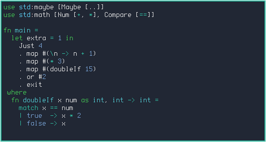

# Running

Currently there's two native targets with basic support. Glibc and statically linked Linux with raw syscalls. The default as glibc. 

See `compile-then-link-to-libc-and-run.sh` for help. 

To use the syscall backend, you need to assemble the appropriate file(s) in `assembly/` to object files with the same name. `nasm -o x86_64-linux-syscall.o x86_64-linux-syscall.asm`

# Logging

This project is using `tracing_tree` combined with `env_logger`. To track a specific entity throughout the compilation pipeline, use: 
`RUST_LOG="[{entity=myFunction}]=trace"`

To get an overview look of what the compilers doing then use `RUST_LOG=info`

## Status

Most language features, basic and advanced, lower to LIR and can compile natively with Cranelift. The main blocker right now is the lack of a finished garbage collector.
All allocations currently leak unless manually freed with `do libc:free ptr then ...`. String literals currently just lower to global static data and yields a raw pointer. Garbage collector is the blocker for proper strings. 

C-representation of declared data is currently not supported. To call FFI functions you need to write in primitives manually according to the C-abi.
Lumina's own ABI is currently a transparent representation of the data given. So; the C ABI can be followed manully on top. 

### Known remaining major tasks for public release

 - [ ] Garbage Collector
 - [ ] Basic guide/showcase
 - [ ] Replace all remaining `todo!("ET: ");`s with proper error messages
 - [ ] Give the compiler the ability to detect and use system linkers
 - [ ] Vectorised linked lists or finger trees as default list desugaring
 - [ ] Fix the type checker sometimes confusing the expected type with the given type and vice-versa
 - [ ] Basic Windows target
 - [ ] Basic MacOS target
 - [ ] Basic introductory website hosted on our domain
 - [ ] Re-add the unreachability warning messages
 - [ ] Strings
 - [ ] Basic standard library

### Known remaining major tasks for after public release

 - [ ] Associated types
 - [ ] Trait-overloaded key-value syntactic sugar for hashmaps
 - [ ] Higher kinded types (monomorphised)
 - [ ] Documentation Generator
 - [ ] `@[repr "C"]` attributes and FFI-binding generator
 - [ ] Incremental compilation
 - [ ] Self-hosted compiler reimplementation
 - [ ] Stack backtraces and runtime debugging
 - [ ] Code formatter
 - [ ] Syntax files for various text editors
 - [ ] Specialisation and compile-time type reflection (plan is to use this instead of macros)

### Known remaining minor tasks for after public release

 - [ ] Inline smaller sum-type data payloads for increased performance
 - [ ] Natively aligned data for improved performance
 - [ ] Stable public function symbols
